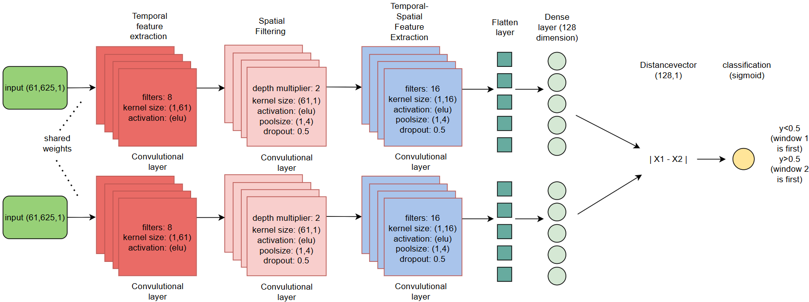
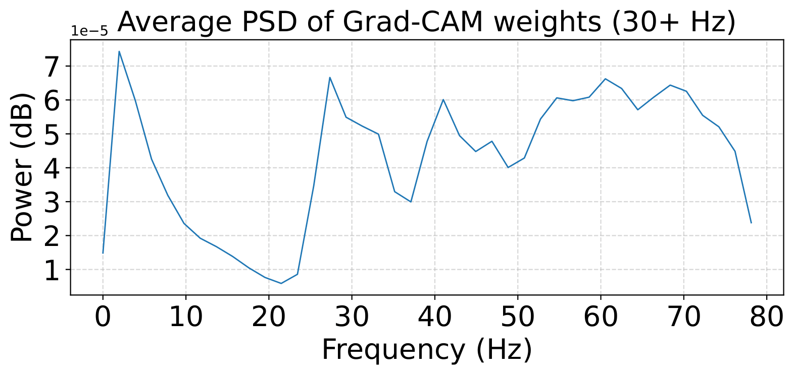
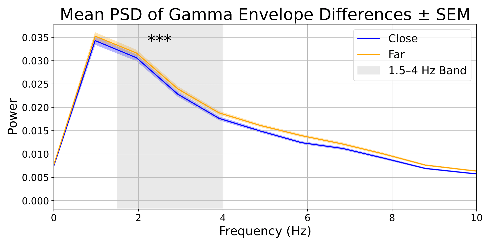

# Temporal_dynamics_XAI
GitHub repository for the paper **"Unraveling Temporal Dynamics in Resting-State Data with an Interpretable Siamese Convolutional Neural Network"** by Sergio Kazatzidis. The paper can be accessed [here](Thesis_unraveling_temporal_dynamics_Sergio_Kazatzidis.pdf). To work with this repository, download **Subject Data Set 1** of the preprocessed data from [this site](https://fcon_1000.projects.nitrc.org/indi/retro/MPI_LEMON/downloads/download_EEG.html) and place all files in a folder named `subject_data`. Further preprocessing is performed in `Preprocessing.py`. You can train the model from scratch using `training_model.py` or use any of the pre-trained models in the `saved_models` folder. All analyses are performed in `analysis.py`.


How time is exactly represented in the brain remains a fundamental and unresolved question. In this study, we employed the Relative Positioning task to train a model to learn temporal dynamics from resting-state EEG data. Specifically, the model was tasked with determining whether two EEG windows were temporally close or distant. We utlized a Siamese convolutional neural network architecture.


We achieved the highest accuracy of 77.22\% when training on data filtered above 30 Hz, outperforming the other frequency bands, with notable variability observed across subjects. To interpret the model’s decision-making, we applied Grad-CAM, an explainable AI technique, to visualize the features driving classification. Analysis of the power spectral density of the Grad-CAM weights revealed a focus on signals above 30 Hz, as well as a prominent peak around 2 Hz. 




Further examination showed that the most important Grad-CAM weights in the 1.5–4 Hz range reflected changes in power modulation and rhythmicity of gamma oscillations. Our findings suggest that this low-frequency peak in the Grad-CAM weights reflects slow fluctuations in the gamma envelope, which likely encode temporal structure and could be used to differentiate temporally close and distant segments in resting-state EEG. As shown in the figure below:



## Dependencies
Python 3.12.6 has been utilized for this project.
Install the required Python packages using the following command:

```bash
$ pip install -r requirements.txt
```

For questions, please contact Sergio Kazatzidis at s.kazatzidis@gmail.com.
